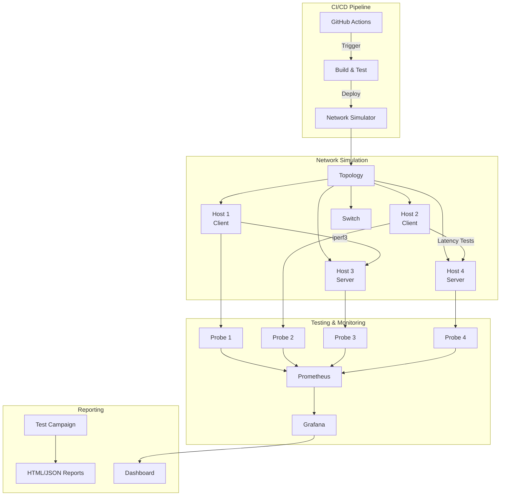

# NetAutoTest 

[](https://github.com/yourusername/NetAutoTest/actions)
[](https://www.python.org/downloads/)
[](LICENSE)
[](https://yourusername.github.io/NetAutoTest/)

**NetAutoTest** est un framework DevOps complet pour l'automatisation de tests de performance et le monitoring réseau sur un réseau local simulé.

##  Table des matières

- [Vue d'ensemble](#vue-densemble)
- [Fonctionnalités](#fonctionnalités)
- [Architecture](#architecture)
- [Installation](#installation)
- [Utilisation rapide](#utilisation-rapide)
- [Documentation](#documentation)
- [CI/CD](#cicd)
- [Contribution](#contribution)

##  Vue d'ensemble

NetAutoTest permet de :
- ✅ Automatiser des campagnes de tests de performance (latence, débit, jitter, perte de paquets)
- ✅ Simuler des réseaux TCP/IP réalistes avec Containernet
- ✅ Déployer des sondes de supervision en temps réel
- ✅ Intégrer tout dans un pipeline CI/CD avec GitHub Actions
- ✅ Générer automatiquement une documentation technique complète

## ✨ Fonctionnalités

### 1. Simulation réseau réaliste
- Topologies configurables (star, line, mesh)
- Simulation de latence, perte de paquets, limitation de bande passante
- Hôtes Docker intégrés via Containernet

### 2. Tests de performance automatisés
- Tests TCP/UDP avec iperf3
- Mesures de latence personnalisées (RTT, jitter)
- Détection de perte de paquets et retransmissions
- Génération de rapports JSON et HTML avec graphiques

### 3. Monitoring en temps réel
- Sondes Prometheus légères
- Métriques système (CPU, mémoire, réseau)
- Dashboard Grafana pré-configuré
- Alertes configurables

### 4. CI/CD intégré
- Workflows GitHub Actions complets
- Tests automatiques sur push/PR
- Validation des seuils de performance
- Publication automatique de la documentation

## 🏗️ Architecture



## 🚀 Installation

### Prérequis

- Linux (Ubuntu 22.04/24.04 recommandé)
- Python 3.11+
- Docker & Docker Compose
- Privilèges sudo (pour Containernet)

### Installation en une commande

```bash
# Clone le repository
git clone https://github.com/yourusername/NetAutoTest.git
cd NetAutoTest

# Installation automatique
make install
```

### Installation manuelle

```bash
# 1. Installer les dépendances système
sudo apt-get update
sudo apt-get install -y python3-pip python3-venv docker.io docker-compose iperf3

# 2. Créer un environnement virtuel
python3 -m venv venv
source venv/bin/activate

# 3. Installer les dépendances Python
pip install -r requirements.txt

# 4. Installer Containernet
sudo make install-containernet
```

## 📖 Utilisation rapide

### 1. Lancer une simulation réseau

```bash
# Démarrer la topologie
make sim

# Ou manuellement
python src/simulator/network_simulator.py start
```

### 2. Exécuter une campagne de tests

```bash
# Campagne complète
make test

# Ou avec configuration personnalisée
python src/tests/run_test_campaign.py --config config/config.yaml
```

### 3. Démarrer le monitoring

```bash
# Lancer les sondes et Prometheus
make monitor

# Accéder à Grafana (http://localhost:3000)
# Login: admin / admin
```

### 4. Générer la documentation

```bash
make docs
# La documentation sera disponible dans docs/_build/html/
```

## 📊 Exemples de résultats

### Rapport de test HTML
Les rapports générés incluent :
- Graphiques de latence (RTT min/moyen/max)
- Graphiques de débit (TCP/UDP)
- Analyse de jitter et perte de paquets
- Métriques système

### Dashboard Grafana
- Vue d'ensemble en temps réel
- Métriques réseau par hôte
- Alertes configurables

## 🔧 Configuration

Le fichier `config/config.yaml` permet de configurer :
- Topologie réseau
- Paramètres de tests (durée, nombre d'itérations)
- Seuils d'alerte (latence max, perte max)
- Paramètres de monitoring

Exemple :
```yaml
network:
  topology: "star"
  hosts: 4
  latency_ms: 10
  packet_loss: 0.1

tests:
  duration_seconds: 60
  iterations: 5
  thresholds:
    max_latency_ms: 50
    max_packet_loss_percent: 1.0
```

## 🧪 Tests

```bash
# Tests unitaires
pytest tests/unit/

# Tests d'intégration
pytest tests/integration/

# Tous les tests
make test-all
```

## 📚 Documentation

La documentation complète est disponible :
- **En ligne** : [https://yominax.github.com/NetAutoTest/](https://yominax.github.com/NetAutoTest/)
- **Locale** : Après `make docs`, ouvrir `docs/_build/html/index.html`

Sections incluses :
- Architecture détaillée
- Guide d'utilisation
- API Reference
- Procédures de tests
- Configuration avancée

## 🔄 CI/CD

Le workflow GitHub Actions :
1. ✅ Build et test automatiques sur chaque push/PR
2. ✅ Validation des seuils de performance
3. ✅ Génération et upload des rapports
4. ✅ Publication de la documentation sur GitHub Pages

Voir `.github/workflows/ci.yml` pour plus de détails.

## 🤝 Contribution

Les contributions sont les bienvenues ! Veuillez :
1. Fork le projet
2. Créer une branche (`git checkout -b feature/AmazingFeature`)
3. Commit vos changements (`git commit -m 'Add AmazingFeature'`)
4. Push vers la branche (`git push origin feature/AmazingFeature`)
5. Ouvrir une Pull Request

## 📝 License

Ce projet est sous licence MIT. Voir le fichier `LICENSE` pour plus de détails.

## 👥 Auteurs

- **MOUTAOUAFFIQ Sidi** - *Création initiale*

## 🙏 Remerciements

- Containernet pour la simulation réseau
- Prometheus & Grafana pour le monitoring
- iperf3 pour les tests de performance

---

 Si ce projet vous est utile, n'hésitez pas à lui donner une étoile !
